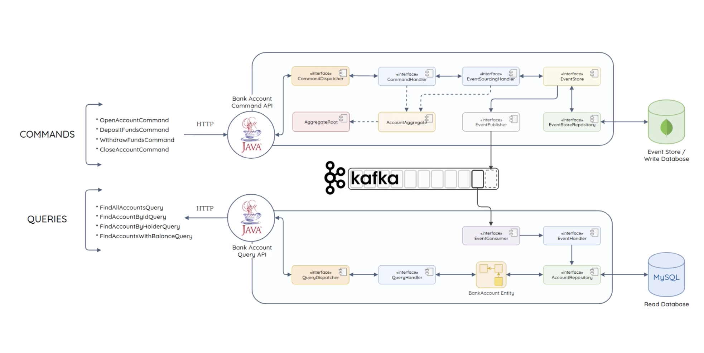

# spring-bank-microservices-app

Learning Microservices Pattern - CQRS & Event Sourcing with Kafka. A simple app to open and close a bank account, add and remove funds and also query all transactions. Build with Spring Boot + Kafka and MySQL + MongoDB.

