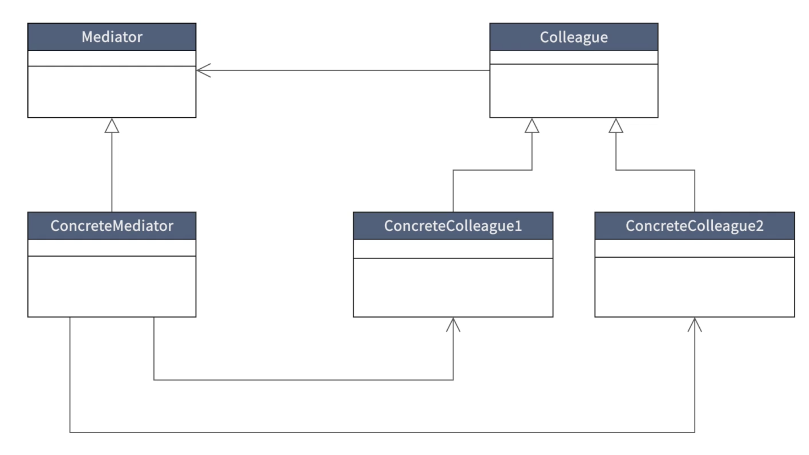
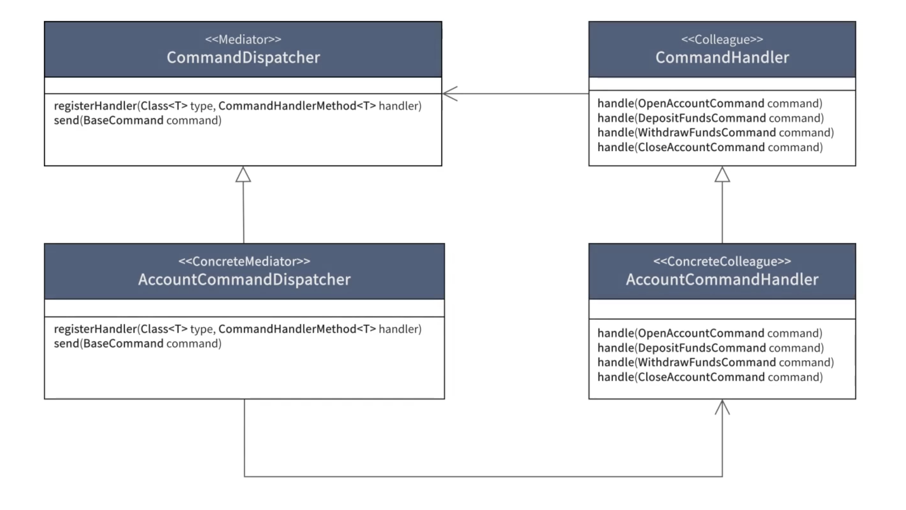

### Principles of Microservices -

- Microservices should not share code or data.
- Avoid unnecessary coupling between services and software components.
- Independence and Autonomy are more important than code re-usability.
- Each microservice should be responsible for single system or process.
    - Because if it fails - we will more all those functions.
- Microservices should not communicate directly with each other, they should make use of an event / message bus to communicate with one another.

Summary - "Each microservice should believe that is the only service in the world."

### CQRS and Event Sourcing -

- CQRS - **Command Query Responsibility Segregation.**
- It is a design pattern which suggests that applications should be divided in command and query part.
- Commands alter the state of an object & queries return the state of an object / entity.
    - Read and Write operations are separate concerns.
- Beneficial when the reads out number the writes or vice-versa.

- Data is often more frequently queried than altered, or vice-versa.
- Segregating commands and queries enables us to optimise each other for high performance.
- Read and write representations of data often differ substantially.
- Executing command and query operations on the same model can cause data contention.
- Segregating read and write concerns enables you to manage read and write security separately.

### Event Sourcing -

- Event Sourcing defines an approach where all the changes made to an object or entity are stored as a sequence of immutable events to an event source as opposed to just saving the current state of the object or entity.

### Benefits of Event Sourcing -

- The event store provides a complete log of every state change.
- The state of an object / aggregate can be recreated by replaying the event store.
- Improves write performance - All event types are simply appended to the event store. There are no update or delete operations.
- In case of failure, the event store can be used to restore read database.

### Apache Kafka

- Apache Kafka is an open-source distributed event streaming platform that enables the development of real-time, event-driven applications.

#### CQRS Topics -

- **Command** - Command is a combination of expressed intent. It describes something that you want to be done. It also contains the information required to undertake action based on that intent. Commands are named with a verb in the imperative mood.

- **Events** - Events are objects that describe something that has occurred in the application. A typical source of events is the aggregate. When something important has occurred within the aggregate, it will raise an event. Events are typically named in past participial verb.

### Mediator Pattern

- Behavioural Design Pattern.
- Promotes loose coupling by preventing objects from referring to each other explicitly.
- Simplifies communication between objects by introducing a single object known as the mediator that manages the distribution of messages among other objects.
- In this project - messages are commands.

#### CQRS Topics contd. -

- **Aggregate** - An aggregate is an entity or group of entities that is always kept in a consistent state. The aggregate root is the entity within the aggregate that is responsible for maintaining the consistent state. This makes the aggregate the primary building block for implementing a command model in any CQRS based application.

- **Event Store** -
  - Event store is a database that is used to store the data as a sequence of immutable events over time. It is a key enabler of event sourcing.
  - An event store must be an **append only store**, no update or delete operations should be allowed.
  - Each event that is saved should represent the version or state of an aggregate at any given point in time.
  - Events should be stored in chronological order, and new events should be appended to the previous event.
  - The state of the aggregate should be regrettable by replaying the event store.
  - The event store should implement optimistic concurrency control.

